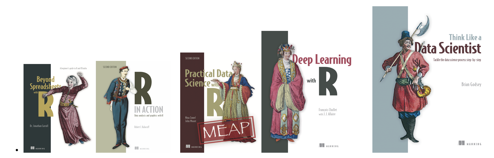
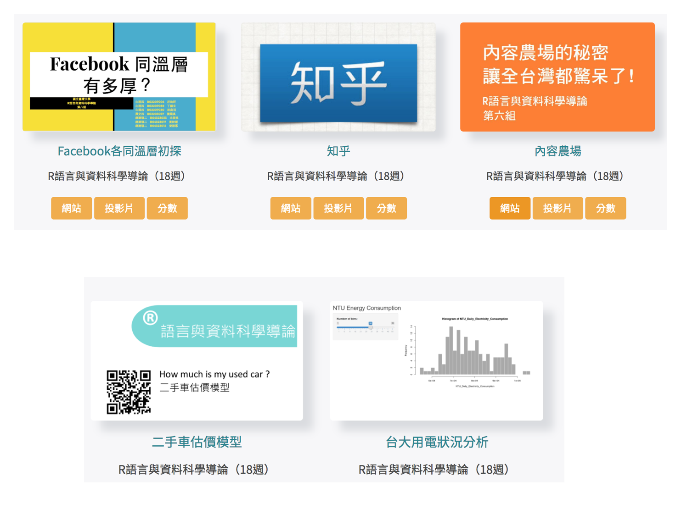
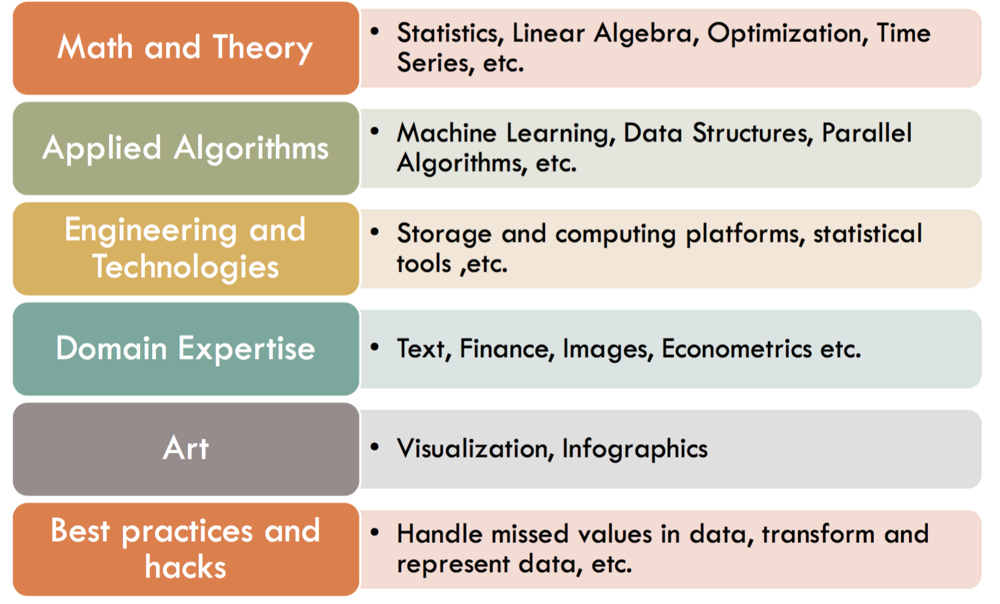
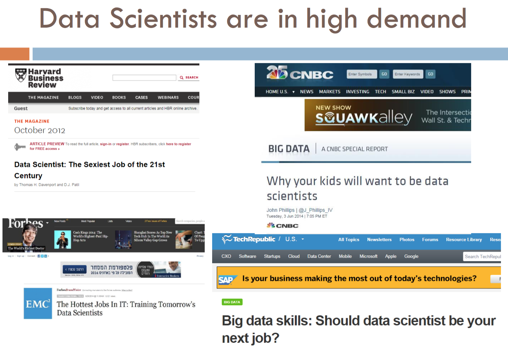
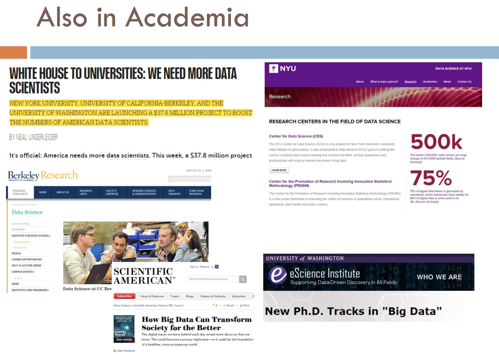
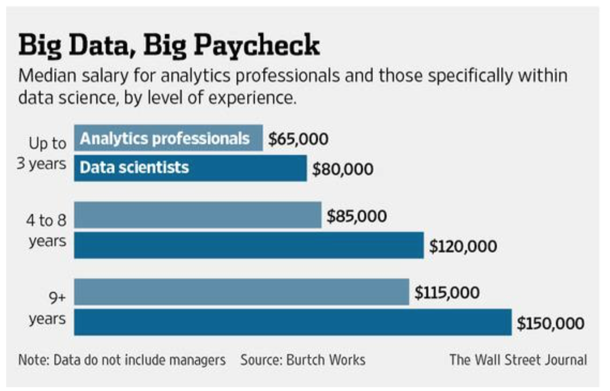
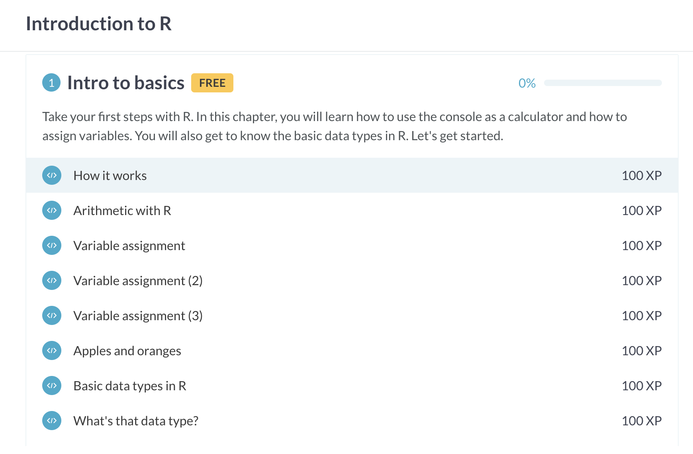

```{r setup, include=FALSE}
options(htmltools.dir.version = FALSE)
```

class: title-slide

.bg-text[
# Introduction to Data Science with R
### week.2.Introduction

<hr />

`r format(Sys.Date(), '%B %e, %Y')`  
謝舒凱
]


---
# 課程資訊

- [課程網頁](https://rlads2019.github.io/)

- Office hour: 週四中午或課後 (請先 email 預約 `shukaihsieh@ntu.edu.tw`)

- TA hour: 週三 12:30-13:30 


---
# 今天主題

- 資料科學與文本分析導論

- R 基本語法


---
# 相關教科書

- 每個出版社有自己的定位與規劃，挑自己喜歡的系列


</img>


---
## 學習是歷程，成果當孩子


</img>


---
## 我們活著的時代背景：Data is the KING

[How much data is generated every minute?](
https://www.socialmediatoday.com/user_media/diveimage/18_domo_data-never-sleeps-7-01.jpg)


---
## 我們活著的時代背景：不管妳喜不喜歡

`行動`、`嵌入`、`穿戴`、`社群`、、、
- 當人變成了巨量數據的集合:  物聯網，車聯網，衣聯網，腦聯網
- 我的 * 不是人（理專、男友、教練、老師、看護、司機）（老闆？）

</img>

???
線下人生，何時才能【下網】？


---
## Data 》 Information 》 Knowledge 

- 不同類型的數據 

> Biological signals, music, images, video, customer reviews, webpages, medical records, software, game logs, social networks, environmental signals, astro-data, neuron spikes, etc.

- 主要大類型：Symbols/Signs and Signal
 


---
## Data Science 在做什麼


> This frontier is expanding vastly thanks to new developments in mathematical modelling, algorithms, data management and computing infrastucture. It is having a profound impact not only in science and medicine, but also in e-commerce, marketing, humanities and society at large. Inference and learning with massive datasets is also the key ingredient of the intelligent machines of the future.

- 一句話：把數據變成資訊以供`預測應用`/`產生價值`/`累積知識`的科學


---
## Data Science : `A mashup of disciplines`

</img>


---
## Data Science Processs Flowchart
`(source: wiki)`

</img>


---
## OSEMM MODEL

-【獲取】Obtaining data 

-【整理】Scrubbing data

-【探索】Exploring data

-【建模】Modeling data 

-【詮解】Interpreting (and reporting) data 


---
## Text analytics / Text mining / NLP / Machine Learning ???

文本數據分析：利用`自然語言處理 + 機器學習` 對於文本數據做各種預測與應用。

- [**Data Science**] Linguistic/textual `data` processing

- [**Natural Language Processing**] Linguistic/textual `information` processing

- [**Semantics, Ontologies, AI and Language Understanding**] Linguistic/textual `knowledge` processing

應用:

> 七情六慾、消費口味、監控信用風險、工作面試、醫療保險、戀愛與犯罪機率、偏見、誤解、私心、運動模型、新聞宣傳、法律專利、博弈、線上聲譽、(reputation.com)、市政感想、生醫文獻搜尋 (Quertle)、選情預測、顧客滿意度、。。。


---
## 有種簡單的說法

</img>


???
This course will provide an introduction to this exciting growing cross-disciplinary field. It will teach the basic principles and skills required for analysing textual data in a programmable way: finding linguistic patterns, dimensionality reduction, clustering, classification and prediction. Students will also have the opportunity of learning R (and command-line programming).


---
## 各種數據的匯合愈玩愈大
### DS and BIG data, and Dataclysm

- **資料排氣** (data exhaust): 行車時手機的 GPS 回報所在位置；信用卡購買紀錄；Google 搜尋記錄追蹤；FB 人際互動；智慧電錶記錄能源使用。

- 根據手機上的資料，就能預測距今一年半後你會出現在何處。精準度為一個小時內，一條街以內。 

- **無所不在的感知器** (sensor)： 根據膚電反應（皮膚導電性）測量你對某項活動的興趣或投入程度 (Q Sensor)；
根據你說話的語氣和抑揚頓挫預測與偵測心情起伏 (Cogito);...


---
## DS 的潛力

- 發掘知識 / Knowledge Dscovery 

<!-- 妳是負責追蹤麥當勞的分析師 有新店要開張，它必須向聯邦通訊委員會申請設立得來速 窗口對講機系統的執照，藉由發照資料，你可以追蹤開店狀況，但妳可能不知道這一點。讓資料找上妳！ -->


- 繁榮商業應用 / Data Science for Business   
  
- 促進開放政府與開放社會 / Data Science for Social Good
   - *PRISM Program* 網路全民監控 <> http://enigma.io
   - (http://data.gov) (http://data.gov.uk) (http://data.taipei/opendata)
   - [College Scorecard](https://collegescorecard.ed.gov/) 哪一所大學讓你獲得最高的投資報酬率。
   
   <!-- 食安、能源、運輸、醫療、地產、通訊、教育 -->
   
- 網路安全與黑資料（源源不絕）
  - 巴拿馬文件
  - Ashley Madison
  - `Deep web` (暗黑網路)


---
## DS, AI and Cognitive Computing
#### 與 AI / 認知計算的整合趨勢


</img>


---
## Brain/Human-Machine Interface

</img>


---
## 資料科學家炙手可熱 

.pull-left[
</img>
]

.pull-right[
</img>
]

---
## Pays well 💰

</img>


---
## [思考] 數據個資保護與偏見
### Data is the new oil, privacy is the new currency

- 便利與透明的兩難

    - 用 `RedLaser` 掃描該產品的條碼，它會立即告訴妳此商品在附近商店的售價（代價：給出妳的位置、購物項目）
    - 願意公布個人資料可以協助理解人口類型、預測大規模流感、控管交通、節省能源、等等。

- 演算正義：【大數據的傲慢與偏見 weapons of math deconstructions】


---
## [思考] DS and Thick Data
### 資料科學與厚數據：資料科學中的質性研究法

- 大數據的量化方法需要經過正規化/標準化的資料處理，無形中剔除數據中隱含的 `背景、意義` 和 `故事`。
（e.g, 斷裂的言談）
- 藉助少量樣本、依賴人的學習能力（而非機器學習）、體現數據關係背後的社會文化、行為動機、包容不可被化約的複雜性。(e.g. 眨眼的人類學觀察)

</img>


---
# 這門課希望你學習與培養的能力

- 程式與邏輯思維

- 解題 (problem-solving) 的歷程

- 想像力與人本思維

- 統計與機器學習（e.g. 深度學習神經網路）技術更新

http://www.mastersindatascience.org/careers/data-scientist/

---
## [練習] 分類、觀察、想像力

課堂小組分組配對：我如何解大學課堂裡存在以久的問題？ 

> [老牌約會對象配對](https://www.okcupid.com/)

---
## [練習] Problem-solving techniques


- 怎麼區分觀影行為以方便區別推薦？

<!-- - 如果我現在在兜圈子，EmoBOT 會注意到我的憂鬱傾向嗎？ -->


---
# Rstudio and Base R

- See notebook (`week2.note`)


---
# DataCamp 閱讀與練習作業

> 哈勒凡：享受自學就不怕市場劇變!

- See links in `sli.do`

- Follow **custom track** (`R 基礎`：期中考前 70 小時自學微課程)


> There is a massive disconnect between what is taught in universities and what is done on a daily basis at startups.


---
# 本週線上練習

</img>


